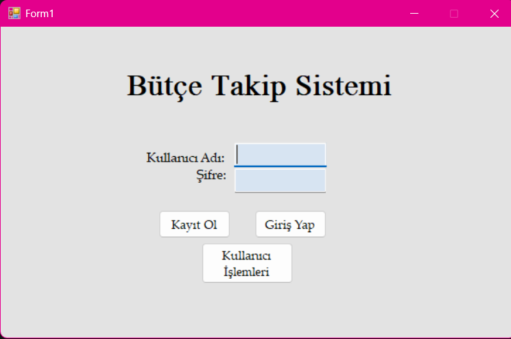
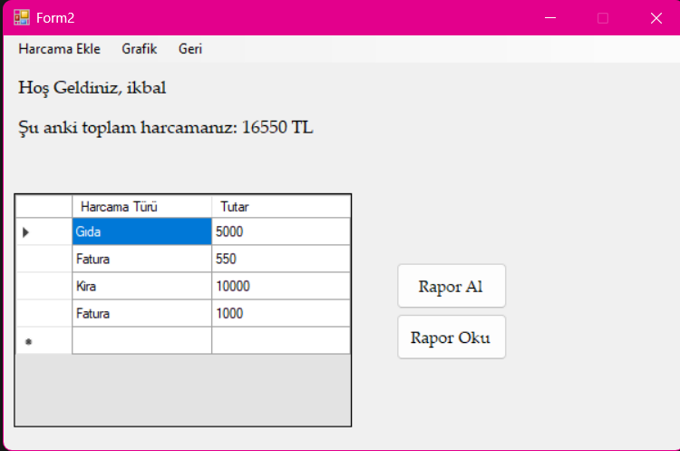
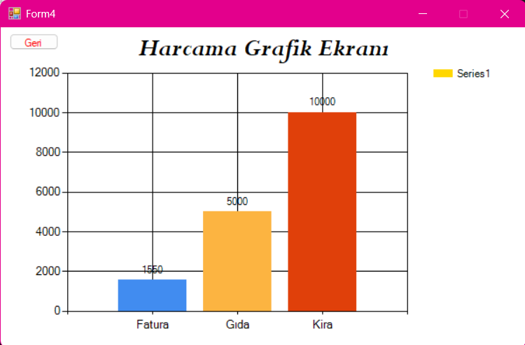
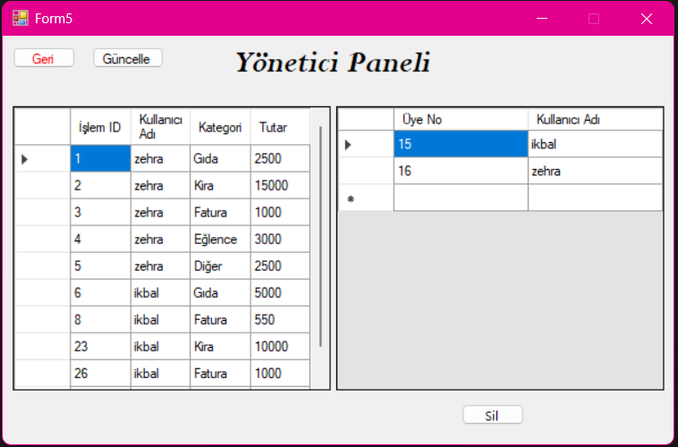

# Bütçe Takip Sistemi 💰

Bu proje, kullanıcıların günlük harcamalarını kategorize ederek kaydetmelerini, bütçe yönetimlerini grafiksel olarak analiz etmelerini ve kullanıcı bilgilerini güvenle güncellemelerini sağlayan bir **Masaüstü Uygulamasıdır.**

## 🛠️ Temel Özellikler
* **Kullanıcı Yönetimi:** Kayıt olma, giriş yapma ve şifre/kullanıcı adı güncelleme işlemleri.
* **Harcama Takibi:** Harcamaları türüne (Gıda, Kira, Fatura vb.) göre ekleyebilme.
* **Grafiksel Analiz:** Yapılan harcamaların çubuk grafik (bar chart) ile görselleştirilmesi.
* **Yönetici Paneli:** Tüm kullanıcıları ve yapılan işlemleri tek bir merkezden görüntüleme ve yönetme.
* **Raporlama:** Harcama geçmişini raporlama ve okunabilir formatta sunma.

## 💻 Kullanılan Teknolojiler
* **Dil:** C# (.NET Framework / WinForms)
* **Veritabanı:** [Buraya kullandığın veritabanını yaz, örn: MS SQL Server / SQLite]
* **Görselleştirme:** Windows Forms Charting API

## 🖼️ Ekran Görüntüleri

| Giriş Ekranı | Harcama Takibi |
| :---: | :---: |
|  |  |

| Grafik Analizi | Yönetici Paneli |
| :---: | :---: |
|  |  |

## 🚀 Kurulum
**1. Repoyu klonlayın:**
   ```bash
   git clone https://github.com/ikbaltorun/ButceTakipSistemi.git
   ```
**2.Proje Klasörüne Girin:**
   ```bash
   cd butce-takip-sistemi
   ```
**3.Projeyi Çalıştırın:**
İndirdiğiniz klasörün içindeki .sln (Solution) uzantılı dosyayı Visual Studio ile açın.
Veritabanı bağlantı ayarlarınızı app.config veya connection strings kısmından kendi yerel sunucunuza göre güncelleyin.
Visual Studio üzerinde "Start" butonuna basarak uygulamayı başlatabilirsiniz.

---
*İkbal Torun | 2026*
